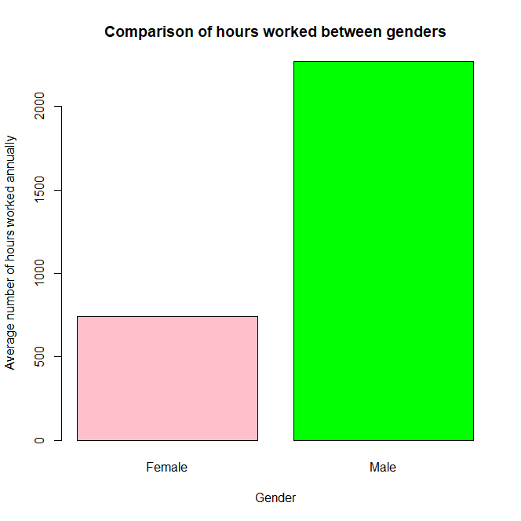
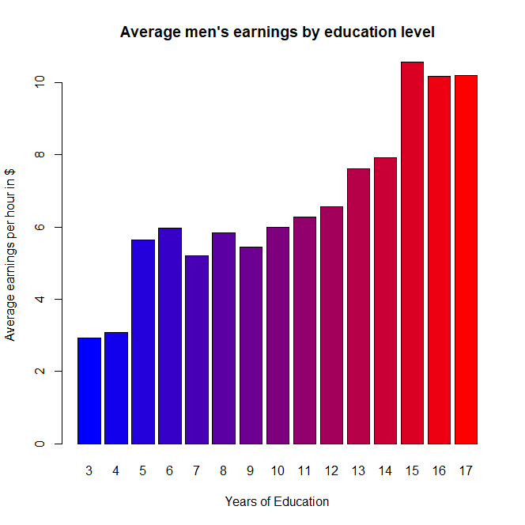
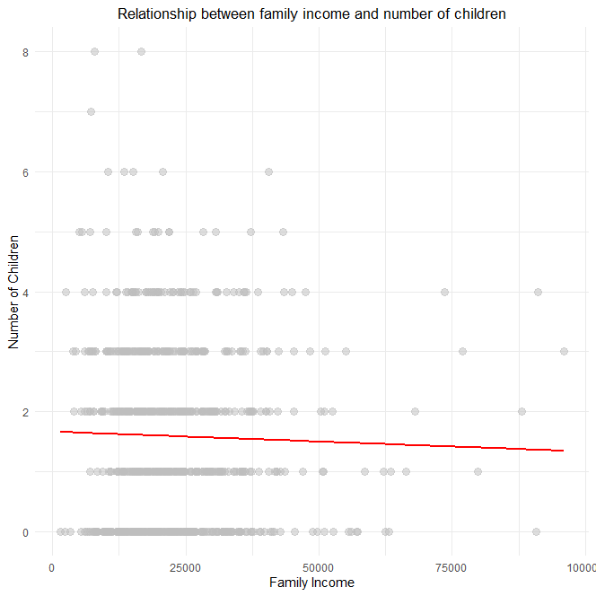
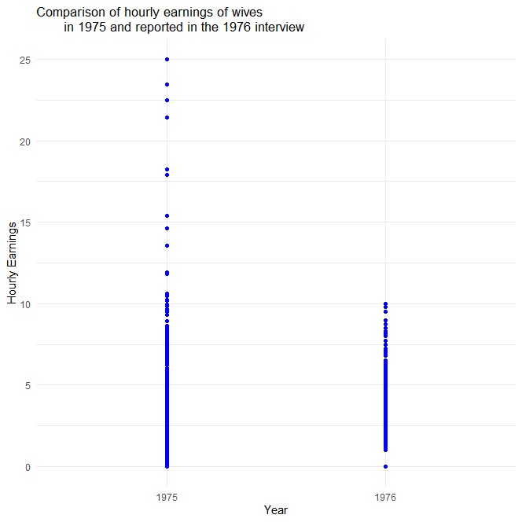
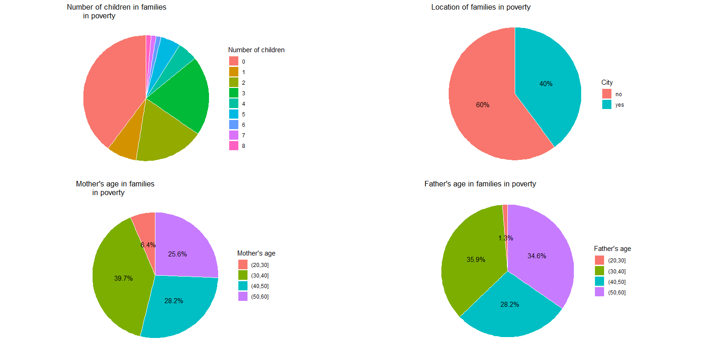
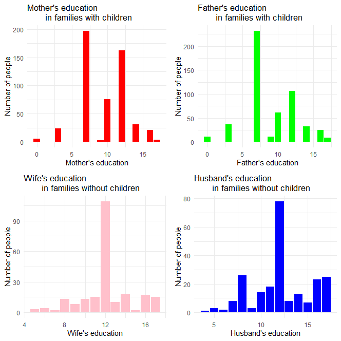

# About project
This project analyzes data regarding marriages and households in the USA, examining aspects such as employment, earnings, number of children, and parental education. It utilizes various data visualization methods, including bar charts, scatter plots, and pie charts, to illustrate relationships between different variables.

# Visualizations
## Number of hours worked annually between men and women

## Relationship between education level and men's earnings

## Relationship between family income and number of children

## Comparing reported and earned income of women

## Calculating the percentage of families in the lowest income brackets

## Analysis of families with and without children

